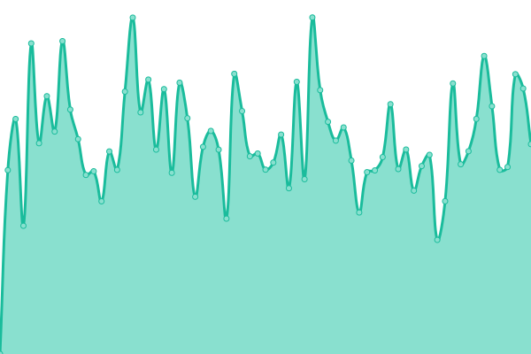
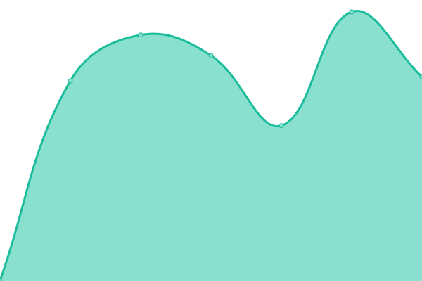
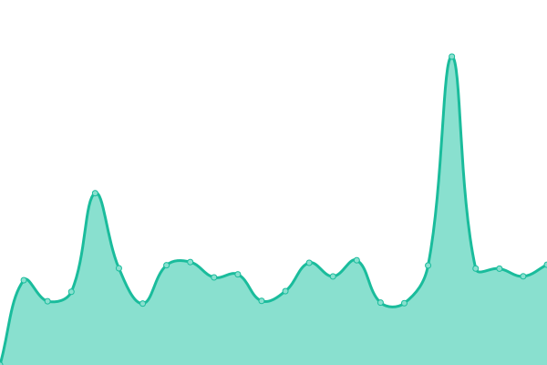
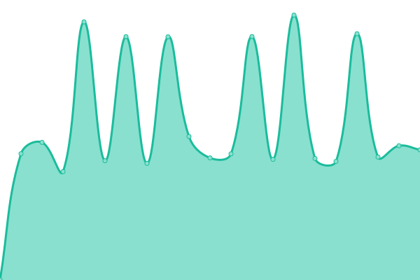
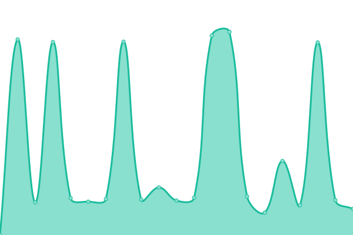

# [📈 实时状态](https://upptime-carsonyang.vercel.app): <!--live status--> **🟧 Partial outage**

This repository contains the open-source uptime monitor and status page for [ Carson Yang](https://fuckcloudnative.io), powered by [Upptime](https://github.com/upptime/upptime).

With [Upptime](https://upptime.js.org), you can get your own unlimited and free uptime monitor and status page, powered entirely by a GitHub repository. We use [Issues](https://github.com/yangchuansheng/upptime1/issues) as incident reports, [Actions](https://github.com/yangchuansheng/upptime1/actions) as uptime monitors, and [Pages](https://upptime-carsonyang.vercel.app) for the status page.

## [📈 Live Status](https://demo.upptime.js.org): <!--live status--> **🟧 Partial outage**

<!--start: status pages-->
<!-- This summary is generated by Upptime (https://github.com/upptime/upptime) -->
<!-- Do not edit this manually, your changes will be overwritten -->
<!-- prettier-ignore -->
| URL | Status | History | Response Time | Uptime |
| --- | ------ | ------- | ------------- | ------ |
|  [Cloud Native](https://icloudnative.io) | 健康 | [cloud-native.yml](https://github.com/yangchuansheng/upptime/commits/HEAD/history/cloud-native.yml) | 

 325ms
     
 | 

<a href="https://yangchuansheng.github.io/upptime/history/cloud-native">100.00%</a>
    

|  [Google](https://google.icloudnative.io) | 故障 | [google.yml](https://github.com/yangchuansheng/upptime/commits/HEAD/history/google.yml) | 

 2876ms
     
 | 

<a href="https://yangchuansheng.github.io/upptime/history/google">96.95%</a>
    

|  [Sealyun](https://www.sealyun.com) | 健康 | [sealyun.yml](https://github.com/yangchuansheng/upptime/commits/HEAD/history/sealyun.yml) | 

 338ms
     
 | 

<a href="https://yangchuansheng.github.io/upptime/history/sealyun">100.00%</a>
    

|  [Docker Hub Mirror](https://docker.icloudnative.io) | 健康 | [docker-hub-mirror.yml](https://github.com/yangchuansheng/upptime/commits/HEAD/history/docker-hub-mirror.yml) | 

 648ms
     
 | 

<a href="https://yangchuansheng.github.io/upptime/history/docker-hub-mirror">100.00%</a>
    

|  [gcr.io Mirror](https://gcr.icloudnative.io) | 健康 | [gcr-io-mirror.yml](https://github.com/yangchuansheng/upptime/commits/HEAD/history/gcr-io-mirror.yml) | 

 694ms
     
 | 

<a href="https://yangchuansheng.github.io/upptime/history/gcr-io-mirror">100.00%</a>
    

|  [Umami](https://umami.icloudnative.io) | 健康 | [umami.yml](https://github.com/yangchuansheng/upptime/commits/HEAD/history/umami.yml) | 

 853ms
     
 | 

<a href="https://yangchuansheng.github.io/upptime/history/umami">90.01%</a>
    

|  [Privatebin](https://privatebin.icloudnative.io) | 健康 | [privatebin.yml](https://github.com/yangchuansheng/upptime/commits/HEAD/history/privatebin.yml) | 

 1473ms
     
 | 

<a href="https://yangchuansheng.github.io/upptime/history/privatebin">90.01%</a>
    

<!--end: status pages-->

[**Visit our status website →**](https://upptime-carsonyang.vercel.app)

## 📄 License

- Powered by: [Upptime](https://github.com/upptime/upptime)
- Code: [MIT](./LICENSE) © [ Carson Yang](https://fuckcloudnative.io)
- Data in the `./history` directory: [Open Database License](https://opendatacommons.org/licenses/odbl/1-0/)
